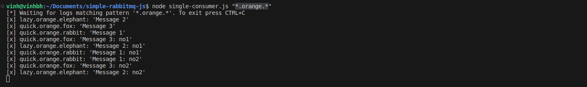

# simple-rabbitmq-js

## Architecture

## Implementation

### Both of producers send messages

### 2 competing consumers receive messages

### 1 single consumer receives messages

## Note

- The single consumer can use a random queue name when binding to the exchange. But all of competing consumers have to bind <b>one specific queue name</b> to the exchange

- In this project, all of competing consumers use a 'letterbox' queue 